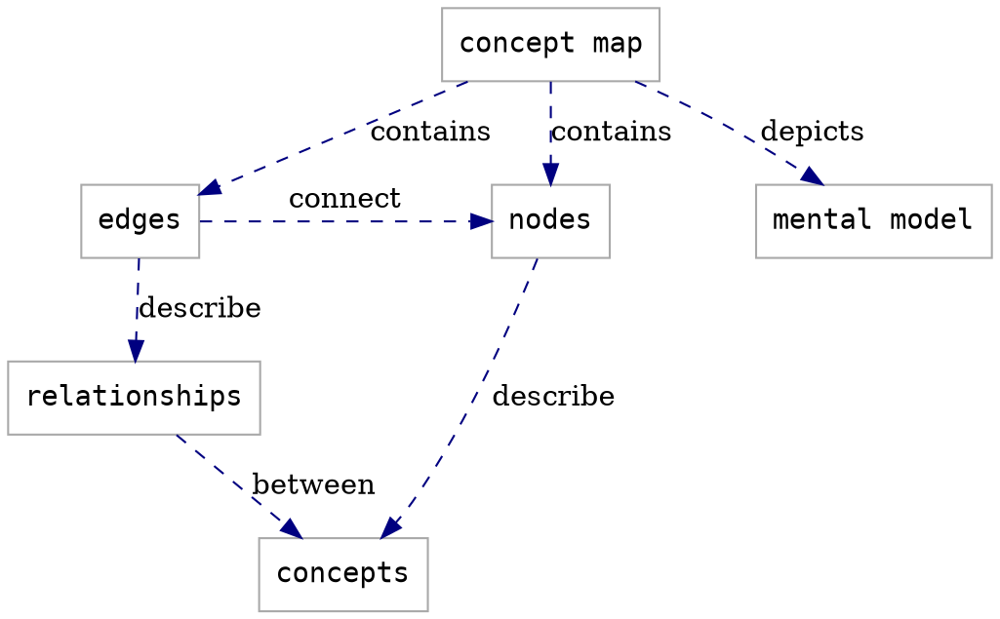

# Lesson Design Notes: AI-assisted Coding with Codeium / GitHub Copilot

:::info
Users are expected to follow **[The Carpentries Code of Conduct](https://docs.carpentries.org/topic_folders/policies/code-of-conduct.html)**.

All content is publicly available under the [Creative Commons Attribution License](https://creativecommons.org/licenses/by/4.0/).
:::

**Lesson Title:** AI-assisted Coding with Codeium / GitHub Copilot  

<!-- inserts a Table of Contents: don't change the line below -->
[TOC]

## Target Audience

1. What is their background?
    - Researchers in the STEM disciplines with any level of seniority (MSc, PhD, postdocs, faculty staff) and various level of coding expertise, frequently use coding environments like VS Code for data analysis, automation, or simulations. There are also some more experienced coders in the group who require precision and control over their code.
    
2. What do they already know how to do?
    - Less experienced coders have minimal coding skills/familiar with any programming language, while more experienced coders are skilled in coding, debugging, and version control. Most have likely heard about AI-assisted tools but may not be fully aware of the best practices for optimizing their use.
    
3. What do they want to do with the skills they will learn from your lesson?
    - Apply the practical skills learned from the lesson to optimize their coding experience, improve the quality and clarity of the code. Less experienced coders want to write better code and get guidance on areas they are unfamiliar with, while experienced coders aim to streamline workflows and code efficiently, managing security and ethical risks effectively.
    
4. What problem will your lesson help them solve?
    - Setting up AI coding assistant, code generation, autocompletion, improving existing code, fixing bugs. In particular, it will help less experienced coders identify and avoid errors and write better code, while enabling experienced coders to code more efficiently by automating repetitive tasks and focusing on more complex challenges.

Minimal prerequisites:
- Basic computer skills and fundamental coding knowledge (e.g., knowledge of different data types, loading data, writing simple functions)
- Familiarity with a code editor (e.g., VSCode)
- Interest in AI-assisted coding tools

### Notes

FIXME add any relevant information about how and why you chose this target audience. 
Information like this can be helpful for future collaborators/contributors/users to understand the scope of your lesson.

## Lesson Learning Objectives

### Learning Objectives
After following this lesson, learners will be able to:
 
* Generate code and optimize its performance using an AI coding assistant
* Refactor and improve the structure and quality of existing code using an AI coding assistant
* Automate repetitive coding tasks using AI coding assistant
* Generate and improve documentation using AI coding assistant
* Recognize, evaluate, and mitigate ethical and security considerations when using AI coding assistant

### Notes

FIXME add any relevant information about how and why you defined these objectives. 
Information like this can be helpful for future collaborators/contributors/users to understand the scope of your lesson.

## Data Set/Narrative

* Which datasets and narratives did you consider?
    * We considered dataset which could be interesting for researchers across different fields: climate change, genomics, astronomy.
* How and why did you choose between them?
    * We choose climate change, in particular atmosferic CO2 trends, for broad relevance, data complecity and accessibility (see [CO2 PPM - Trends in Atmospheric Carbon Dioxide](https://towardsdatascience.com/timeseries-data-science-curve-fitting-pandas-numpy-scipy-b0cd938ecb59) as a tutorial example).
* What implications do you think your choice of dataset and/or narrative will have for the design and further implementation of your lesson?
    * We will focus on AI-assisted time series analysis, data visualization, and modeling.

## Episodes

### Episode Learning Objectives

#### 1: Introduction to AI coding assistants - Olga
After following this episode, learners will be able to:
* Outline the main AI coding assistants
* Set up Codeium as coding assistant for the lesson

#### 2: Code generation and optimization - Olga
After following this episode, learners will be able to:
* Generate snippets of code using Codeium as AI-assistant
* Optimize performance of the generated code using Codeium as AI-assistant
* Refactor and improve the structure and quality of existing code using Codeium as AI-assistant
* Identify and fix bugs using Codeium as AI-assistant

#### 3:  Enhancing coding efficiency - Giulia
After following this episode, learners will be able to:
* Use an autocomplete function of Codeium as AI-assistant to improve coding speed
* Automate repetitive coding tasks using Codeium as AI-assistant
* Generate and improve documentation using Codeium as AI-assistant
* Compose clear and effective prompts that capture and facilitate the expected outcomes using Codeium as AI-assistant

#### 4:  Ethical and security considerations in AI-assisted coding - Giulia
After following this episode, learners will be able to:
* Recognize and mitigate ethical concerns when using AI coding assistants
* Identify vulnerabilities and implement safety measures for AI coding assistants

## Designing Exercises
**Exercise 1: Code and Functions Generation**

*Objective*: Generate snippets of code using Codeium as AI-assistant

*Instructions:*
Using Codeium as AI-assistant:
- Read a datafile into a Pandas `DataFrame` object, produce datafile descriptives and plot the data distributions.
    - Write a function that takes as input a `DataFrame` and that calculates basic descriptive statistics like: number of rows (`nrow`), number of columns (`ncol`), data types of each column, basic summary statistics (like mean, min, max for numeric columns).
    - Write a function that takes as inputs a `DataFrame` and a column and generate an histogram to visualize data distribution if the column is numeric (e.g., `int64`, `float64`), a bar plot showing the category frequency if the column is categorical. 
- Review the AI-generated code and compare it to the version you would have written independently without the AI-assistant.

*Solo Activity:* Participants work individually on this exercise

**Exercise 2: Optimization with Codeium**
*Objective:* Use Codeium to improve existing code

*Instructions:*
- Provide a sample code that needs optimization (will be an example from the medical field or, alternatively, I’ll search on stack exchange)
- Use Codeium to suggest improvements and restructure the code
- Compare the original and restructured versions (clarity, length…)

*Solo Activity:* Participants work individually on this exercise

**Exercise 3: Debugging Assistance**
*Objective:* Use Codeium to identify and fix bugs

*Instructions:* 
- Introduce a code snippet with errors
- Use Codeium to detect and propose fixes
- Apply and test the corrections

*Group Review:* Discuss the debugging process and compare results

**Exercise 4: Ethical and Security Challenges**
*Scenario 1:* An ethical dilemma involving biased code generation

*Scenario 2:* A data security issue related to the use of AI tools in a sensitive project

*Group Discussion:* How participants would address these scenarios

### Examples before exercises

#### Example before exercise 1

*Instructions:* 
Using Codeium as AI-assistant:
- Create a function that takes a Pandas `DataFrame` with a date column (`average`), aggregates the monthly data into yearly data, and then merges this aggregated `DataFrame` with another `DataFrame` that includes a `year` column. 
- Demonstrate how to compare the `year` column with the added aggregated values of the `average` column, and plot them to ensure they match as expected.

## Additional Design Notes

FIXME add notes to this section that do not fit elsewhere
in the page. Topics for this section might include

- what has been tried that did not work
- learning objectives that you decided to remove (e.g. to trim down the content) and why
- concept maps for all or part of your lesson (see the section below)

## Concept Maps

Concept maps are a useful tool for describing the relationships between concepts. They can be used to visualise one's mental model of a topic. You can use this section to add concept maps that illustrate the design of your lesson and/or the most important information you are trying to communicate in your lesson/its episodes. 

You can embed a photo or other image file, or use the [GraphViz](https://graphviz.org/) syntax demonstrated below.

### Lesson Concept Map

You can put concepts maps for the whole lesson here...

### Episode Concept Maps

...and concept maps for individual episodes here.

:::info
General questions or feedback? Contact [team@carpentries.org](mailto:team@carpentries.org).
:::
